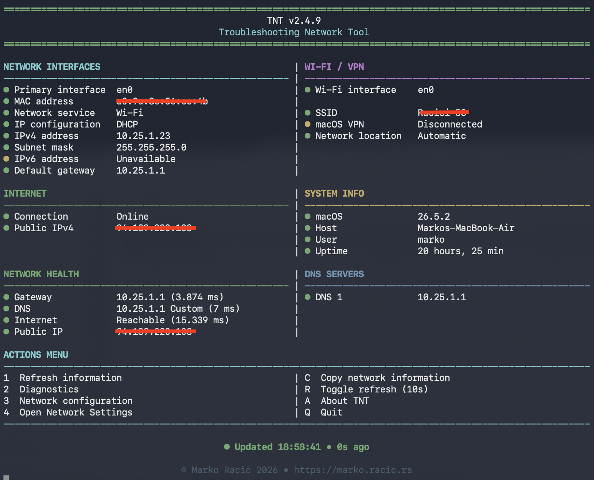
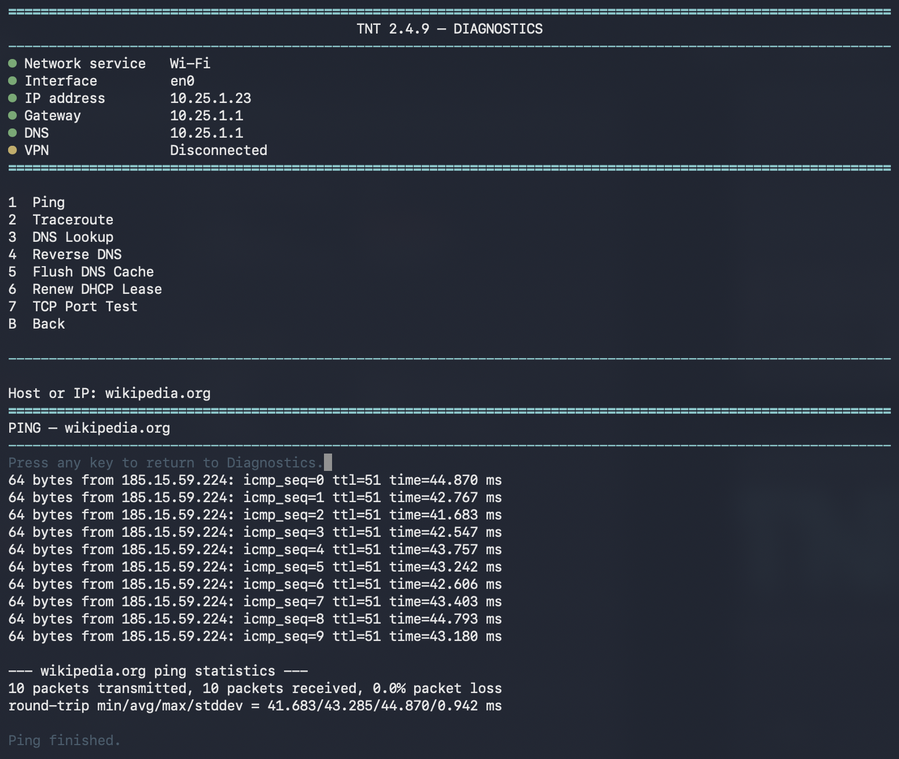
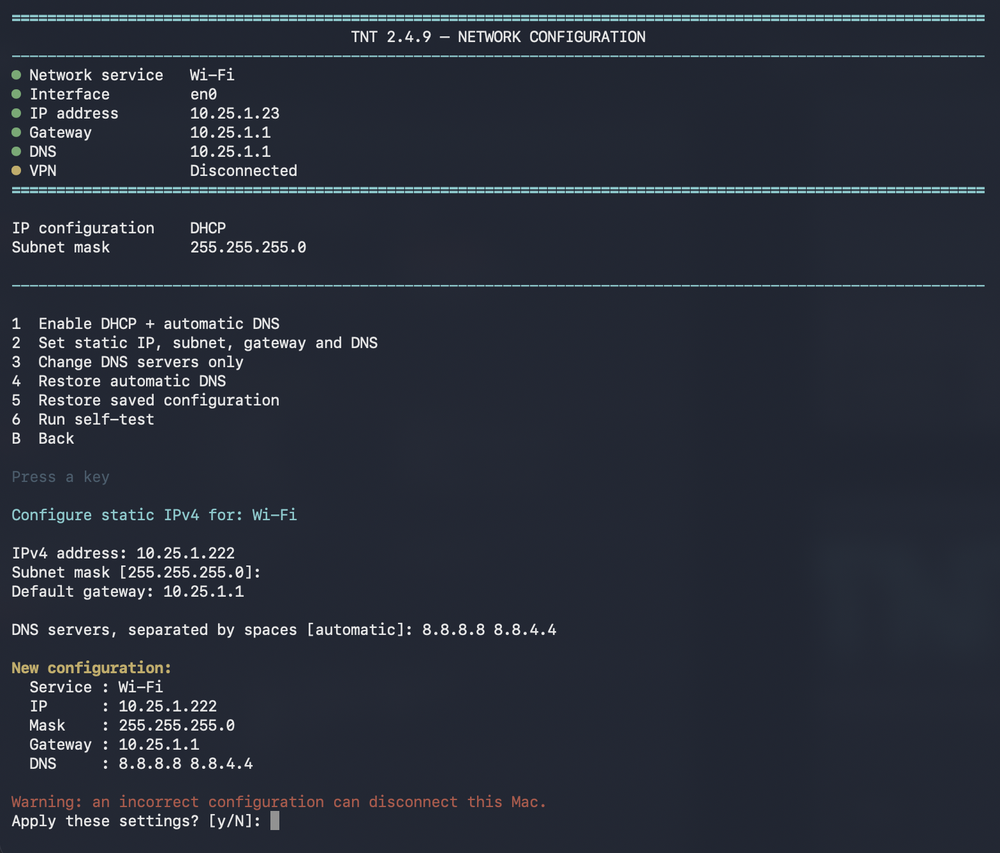

# TNT — Troubleshooting Network Tool

TNT is a keyboard-driven macOS console application for viewing network
information, diagnosing connectivity problems, testing services, and managing
common network settings from one interface.



## Features

- Automatic active-adapter detection
- Live network dashboard
- Network service, interface, MAC, IPv4, IPv6, subnet, gateway and DNS details
- Wi-Fi SSID, VPN status and macOS network location
- Public IP and system information
- Gateway, DNS and internet health checks
- Continuous Ping
- Traceroute
- DNS Lookup
- Reverse DNS Lookup
- TCP Port Test
- DHCP and manual network configuration
- DNS configuration
- Saved network configuration restore
- Copy network information to the clipboard
- Responsive two-column Terminal layout
- Manual, 5-second, 10-second or disabled refresh modes

## Screenshots

### Dashboard


### Diagnostics



### Configuration



## Requirements

- macOS
- Terminal.app
- Bash
- Standard macOS networking tools

## Installation

1. Open the [Releases](../../releases) page.
2. Download the latest `TNT-<version>-Release.tar.gz`.
3. Extract the archive.
4. Optionally move `TNT.app` to `/Applications`.
5. Right-click `TNT.app` and choose **Open** on first launch.
6. If macOS blocks it, open **System Settings → Privacy & Security** and choose **Open Anyway**.

## Building from source

```bash
chmod +x build.sh
./build.sh
```

## Administrator privileges

TNT requests administrator privileges only for operations that modify macOS
network configuration, such as enabling DHCP, assigning a manual address,
changing DNS servers, and restoring saved configuration.

Read-only functions such as the dashboard, Ping, Traceroute, DNS Lookup,
Reverse DNS and TCP Port Test do not modify the system.

Authentication is handled by the standard macOS `sudo` mechanism. TNT does not
read, store, log or transmit the administrator password.

To review every elevated command:

```bash
grep -Rni "sudo" src/
```

See [SECURITY.md](SECURITY.md) for more details.

## Project structure

```text
TNT/
├── src/
├── assets/
├── screenshots/
├── Info.plist
├── build.sh
├── CHANGELOG.md
├── README.md
├── SECURITY.md
├── CONTRIBUTING.md
├── LICENSE
└── .gitignore
```

## Website

https://marko.racic.rs/TNT

## License

TNT is released under the [MIT License](LICENSE).
